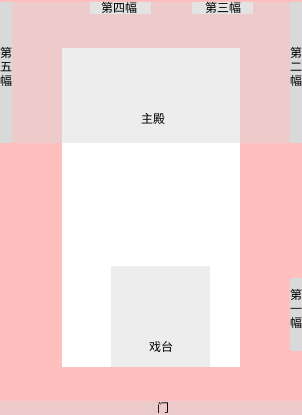

# 内容地图（CONTENT_MAP）

> 用于管理模块 A 的展示内容。不要把模块 B 已完成的交互逻辑复制到这里。
> 所有未确认的文化内容一律标记“待确认”，不得编造。资料来源见 PROJECT_CONTEXT.md「文化资料说明」。
> 模块 A 的图像描述、论文释读与项目设计决定须分别标注。不同论文对年代、主题和人物身份的判断并不完全一致，不能把单篇论文的解释写成已无争议的事实。

## 模块 A：水龙祠壁画叙事引导页面（内容管理）

### A01 开屏（水龙祠）

- 展示边界（2026-09-21 用户确认）：空间穿越、建筑旋转生长、建筑左移与文字浮现完全随滚动推进和还原；最终以完整建筑、简短介绍和探索提示构成稳定阅读画面。动画结束后另设阅读滚动区间，区间内保持最终画面；壁画编号、定位标记与路线高亮从 A02 开始呈现。具体交互与验收要求见 `DESIGN_SPEC.md` 的 A01 交互统一规格。

- 内容：水龙祠（又称水龙庙），位于湖南江永勾蓝瑶寨；现存壁画并不完整。李济民据清乾隆二十五年（1760）重建记载和乾隆二十八年（1763）地方志中的“出兵入将”记录，讨论现存壁画的年代；刘灿姣、林伟（2016）则提出明代断代意见。页面不应将 1763 年写成无争议的实测绘制年份。2019 年的文物保护单位信息在李济民论文中有记述，正式展示前宜再对照官方名录核验准确名称。
- 图片：待补充（可参考模块 B 素材 `assets/splash-bg.png`）
- 来源：李济民 2025，pp.118–119；刘灿姣、林伟 2016，pp.18–21
- 状态：地点与残存状态有文献依据；断代存在不同意见；文保名称待官方核验

### A02 建筑空间

- 展示时机：用户滚过 A01 末尾阅读区间、进入 A02 后，再引入壁画位置标记；反向退回 A01 时隐藏标记。

- 内容：水龙祠壁画分布不止一处，不能将全部壁画概括为大殿两侧山墙。模块 A 采用用户提供的布局示意：观众站在主殿、面向戏台时，身体右侧为第五幅；沿路径前行并左转到第一幅；再前行到主殿右侧的第二幅。第三幅、第四幅的位置参见示意图，暂不纳入这段核心观看路径。
- 图片：用户提供的布局示意图（非建筑测绘图；方位以用户说明的观众站位为准）。

  
- 来源：用户提供的布局示意图及对站位、路线的确认；壁画分布另参见刘灿姣、林伟 2016，pp.19–20，图 3–6
- 状态：项目空间路线已由用户确认；示意图不能单独证明历史观看路线

### A03 出兵·入将

- 内容：以“出兵·入将”作为图像主题入口。李济民（2025）将相关图像解释为迎神赛会的开端与收束，并论述潇贺古道区域的共贺模式及军屯、梅山文化语境；这是该文的研究观点，而非已由壁画单独证实的唯一仪式流程或所有学者的共识。较早的释读还从祭祀、神灵与地域宗教文化等角度解释画面，页面应保留解释空间。
- 图片：待补充
- 来源：李济民 2025，p.116（摘要）、pp.122–123 及注[1]；胡彬彬、吴灿 2016，pp.22–23；吴灿 2017，pp.119–125
- 状态：“出兵·入将”为项目主题；具体仪式性质、年代和文化归属属于学术释读，表述时须注明作者

### A04 右→左观看秩序

- 内容：项目既定的空间观看路径为第五幅 → 第一幅 → 第二幅。参照 A02 的观众站位，先看身体右侧的第五幅，再前行、左转看第一幅，继续前行看主殿右侧的第二幅。“右→左”是这条路线的概括，不表示三幅画并列于同一面墙，也不等于网页始终向左平移。向下滚动只是数字页面推进路线的操作方式。
- 图片：同 A02 布局示意图；后续动效须表现前行与转向
- 来源：用户确认的项目路线；李济民 2025 对“出兵入将”的仪式解释仅作学术参考，不作为此路线的历史证明
- 状态：项目设计方向与路线已确认；历史上是否依此观看，待考证

### A05 壁画介绍

- 内容（《入将图》要点，先描述图像，再介绍释读）：
  - 可辨识的画面线索包括成队人物、旗帜与仪仗器物、动物及狩猎相关情节；局部还可见祭案、香炉、祭品和火炮等元素。实际展陈文字须结合相应画面局部逐一核对。
  - 李济民（2025）把画面中的祭祀、椎牛、火炮及神灵出行队伍与迎神赛会联系起来，并讨论“番王进宝”、张五郎及五猖等形象的意义；这些身份与象征解释均须以“该文认为”引出。
  - 胡彬彬、吴灿（2016）及吴灿（2017）对画面中的人物、器物和宗教文化提出其他释读。涉及具体人物身份、仪式环节、民族归属或象征寓意时，不以单篇释读代替定论。
- 图片：待补充（模块 B 素材 `assets/*/info.txt` 已有各节点介绍可参考）
- 来源：李济民 2025，pp.117–121；胡彬彬、吴灿 2016，pp.22–31；吴灿 2017，pp.119–125
- 状态：可见元素与论文解释须分层核验；人物身份、仪式和寓意不标为“已确认”

### A06 入将图（聚焦）

- 内容：按第五幅 → 第一幅 → 第二幅的空间路径推进后，聚焦《入将图》，最终显示“进入探索”入口（目标：大屏 WebGL 版 `http://localhost:3000/`）。聚焦对象在实际壁面与素材中的对应关系，开发时仍须用原始图像核对，不凭左右壁简称推断。
- 图片：待补充
- 来源：同上；入口目标见 DESIGN_SPEC.md
- 状态：交互目标已确认，实现待开发

---

## 模块 B：《入将图》交互探索

说明：

> 模块 B 已独立开发，具体交互内容以现有项目代码为准。
> 此处仅记录已确认存在的素材资产（基于当前项目代码与素材目录），不重新定义模块 B 的功能。

现有素材节点：

| 节点名称 | 节点位置（public/assets/） | 素材 | 状态 |
|---|---|---|---|
| 01_南门何五猖 | 01_南门何五猖/ | org.png / line.png / color.png / info.txt | 已实现，以现有代码为准 |
| 02_东门陈五猖 | 02_东门陈五猖/ | org.png / line.png / color.png / info.txt | 已实现，以现有代码为准 |
| 03_西门谢五猖 | 03_西门谢五猖/ | org.png / line.png / color.png / info.txt | 已实现，以现有代码为准 |
| 04_中门徐五猖 | 04_中门徐五猖/ | org.png / line.png / color.png / info.txt | 已实现，以现有代码为准 |
| 05_北门雷五猖 | 05_北门雷五猖/ | org.png / line.png / color.png / info.txt | 已实现，以现有代码为准 |
| 06_翻坛张五郎 | 06_翻坛张五郎/ | org.png / line.png / color.png / info.txt | 已实现，以现有代码为准 |
| 07_梅山猖兵 | 07_梅山猖兵/ | org.png / line.png / color.png / info.txt | 已实现，以现有代码为准 |
| 10_上层猖兵 | 10_上层猖兵/ | org.png / line.png / color.png / info.txt / video.mp4 | 已实现，以现有代码为准 |

如需记录模块 B 新增内容，按以下结构登记，并以实际已确认的内容为准：

```text
节点名称：
节点位置：
节点内容：
素材：
交互：
状态：
```

---

## 参考资料

- 李济民：《共贺神赛：潇贺古道民间神祠壁画“出兵入将”图像主题研究》，《装饰》2025 年第 1 期（总第 381 期），第 116–123 页。DOI: 10.16272/j.cnki.cn11-1392/j.2025.01.026（“迎神赛会”解释的主要依据）
- 吴灿：《湖南江永勾蓝瑶寨水龙祠壁画再释读》，《世界宗教研究》2017 年第 6 期，第 119–125 页。
- 胡彬彬、吴灿：《湖南江永勾蓝瑶寨水龙祠壁画释读》，《世界宗教研究》2016 年第 4 期，第 22–31 页。
- 刘灿姣、林伟：《湖南江永水龙祠壁画的发现报告》，《世界宗教研究》2016 年第 4 期，第 18–21 页（另附图版）。
- 论文引用延伸文献（供核验，尚未直接引用）：刘灿姣、杨会娟：《湖南江永勾蓝瑶水龙祠壁画的梅山图考》，《世界宗教研究》2017 年第 5 期；贺景卫、彭勇：《勾蓝瑶水龙祠壁画兵将服饰形象图考及宗教内涵剖析》，《装饰》2019 年第 6 期
