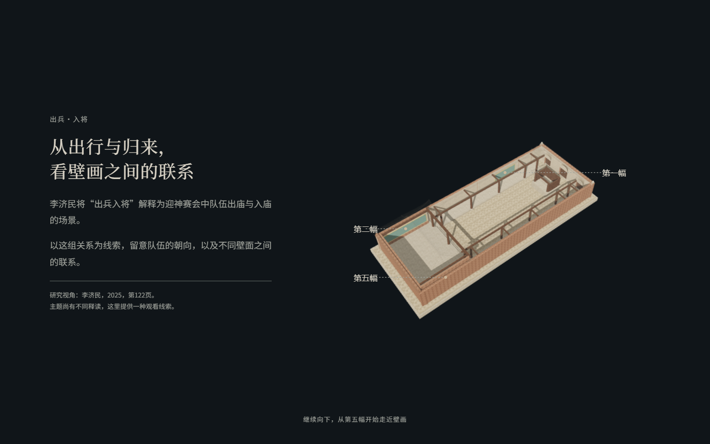
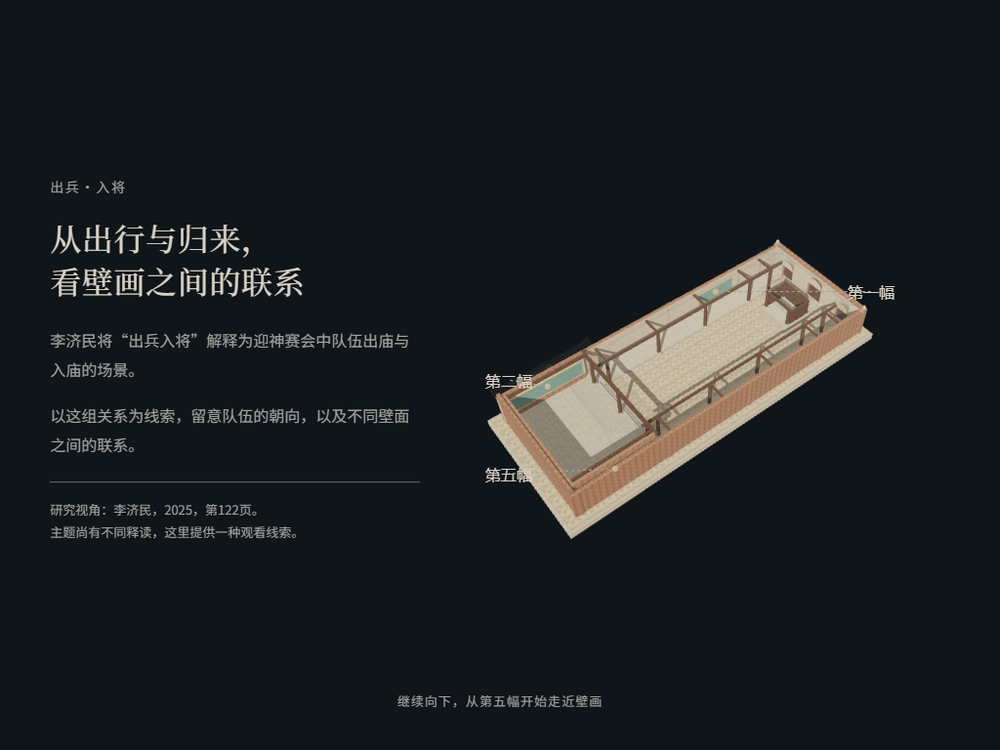
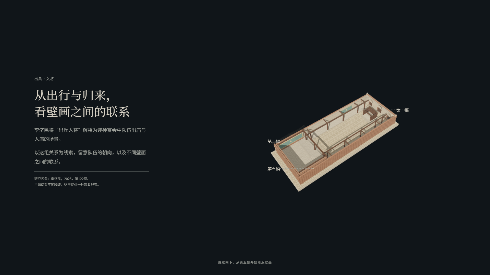
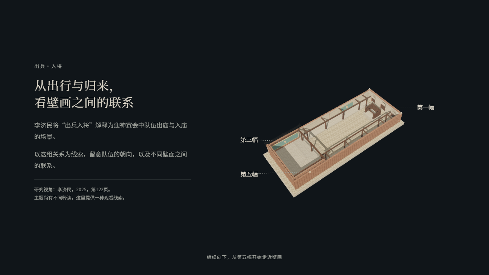

# A03 标题层级验收 · 2026-10-03

用户确认：A01 保留原样；A03 将“出兵·入将”降为主题标识，主标题改为“从出行与归来，看壁画之间的联系”。删除原有重复导语，保留研究解释、观看意图、来源和不同释读提示。此标题属于项目观看引导，不新增历史判断。

开发基线：`a03edbc86fc7b514eabf8f1256d7880bd38272ee`。本轮字号 32–46px 为实际打样参数，不升级为冻结规范。

## 验收

- `node --test`：68/68 通过；修改文件语法检查及 `git diff --check` 通过。
- `node module-a/a03/browser-check.cjs`：1440×900、1440×1024、1366×768、1920×1080、1024×768 全部通过。标题两行，无水平溢出；阅读文字、核心标记和相机关系保留。
- 实际滚轮、反向恢复、刷新、窗口调整、减少动态效果、控制台和素材加载检查通过；详见 [results.json](results.json)。
- A01 往返截图五种尺寸均逐像素一致；A02 往返仍符合原有像素容差。没有修改 A01、模块 B、模型、路径或时序。
- 每种尺寸使用独立浏览器进程，避免跨尺寸 GPU 缓存影响截图比较；原有像素容差未放宽。
- 项目为原生 ES 模块，此局部文字/CSS 改动不需要重新生成模型；语法检查与 localhost 实际资源运行覆盖构建检查。

## 代表截图

