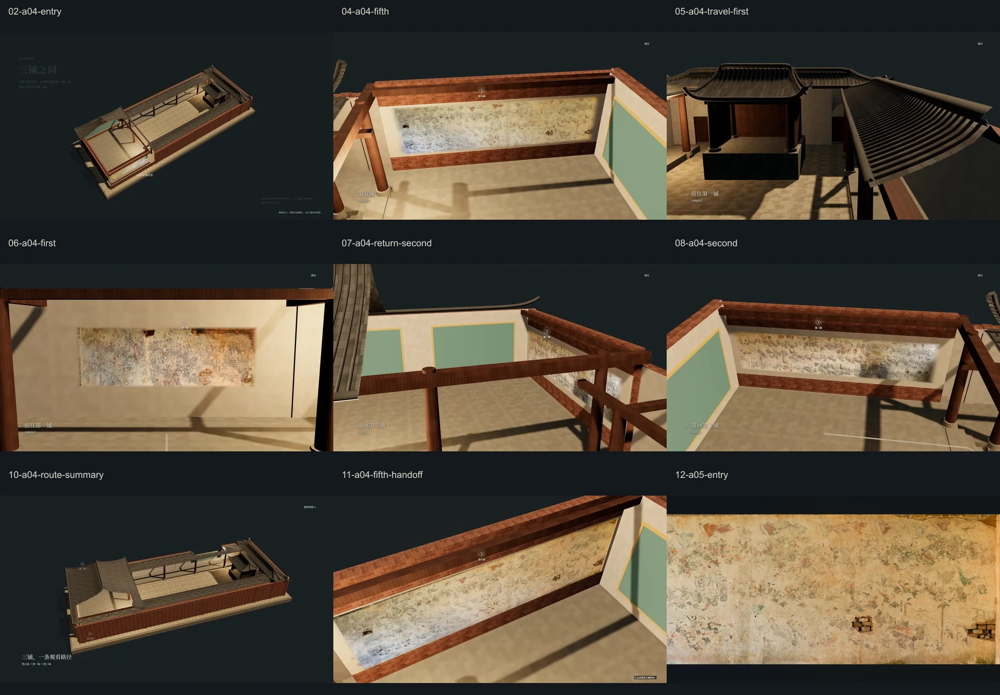

# A04 空间观看路径高保真重制 · 2026-10-05

开发基线：`65e76a187ebdb56a1b877fe9ddb61f2beefc9d08`，开始前fetch核实本地与origin/master一致。范围：Module A A04，以及A03末端舞台/共享cutaway/光照必要交接。依据为本轮用户任务书；旧58秒、全屋顶渐隐、小窗口放大限制由本轮明确授权覆盖。另按用户浏览器反馈将资料边界说明移至右下，字号13px与颜色`#b5b6ad`保持。

最终提交：本报告与实现同一提交，准确SHA用 `git log -1 --format=%H -- docs/validation/a04-high-fidelity-2026-10-05/README.md` 获取；交付消息给出完整SHA及重新fetch后的远程核实结果。报告不能在自身内容内写入自身Git对象SHA。

## 结果与证据

- [修改前后](before-after.webp)：真实旧基线与实际45秒播放，含入口、第五铺、第一铺、完整路线。
- [四尺寸审图](responsive.webp)：1920×1080、1440×900、1366×768、1024×768。
- [45/58秒候选](duration-comparison.webp)：同一路径与里程点的实际播放截图。
- [最终播放状态](after/states.json)、[58秒播放状态](duration-58/states.json)、[旧基线状态](before/states.json)。对应WebP为无改图的截图压缩副本，原PNG保留本地；压缩证据不能替代壁画母版。
- [四尺寸状态检查](review.json)、[浏览器运行](browser/results.json)、[纹理呈现](browser/mural-textures/results.json)、[异常恢复](resilience/resilience.json)、[性能](performance.json)、[构建与保护](build-results.json)。完整运行日志见 `logs/`。

`capture.cjs` 的45/58秒序列是真实时钟播放，未通过改写elapsed加速。四尺寸 `review-check.cjs` 审图通过生产纯函数采样各里程点，不伪称每一张响应式截图都等待完整播放；独立browser-check仍真实等待播放完成并检查暂停/键盘操作。58秒候选将同一45秒故事时间线等比拉长，旧基线58秒则保留原镜头和重复路线总结，二者分别标记。

## 修改与保护

同一建筑root、同一渲染循环/相机/renderer/canvas；A03末端画布连续变为全视口，A04期间CSS尺寸保持全视口。没有新增Canvas、第二场景、第二cutaway管理器或模型资产。复用A03材质剖切hook，统一管理与恢复；移动局部窗口打开当前观看区和必要方向，回撤恢复大部分屋顶。入口/戏台屋顶始终保留，A04屋顶材料opacity=1、depthWrite=true。停靠时支撑墙完整；返回第二铺时提前打开目的侧局部屋面，避免整片主殿屋顶堵住行进方向。

路线世界坐标与⑤→①→②顺序原样保留。一个共享细圆柱geometry、每段已走/未走两份mesh，通过长度和权重呈现三态，无每帧重建geometry/material。当前暖线强于过去痕迹和未来线；总结统一为低权重。三个节点用同一组DOM，只允许一个当前双圈，取消黑底、重复地面编号与HUD观感。左上“三铺之间”，右下资料说明，左下短字幕，右上小型原生跳过/重新观看；删除大底栏。

未修改：Module B、GLB几何、model-source、mural-locations anchor、原始壁画、A05–A08叙事/核心导读、A01稳定样式与入口、低保真归档引用。壁画材料继续toneMapped=false、fog=false；无改色、重绘、AI修复。共享灯光与建筑focus只作用于建筑，非当前建筑轻微降权。字体只重算原Noto本地子集，42,552+89,612=132,164B，没有新增字族或首屏注册。

原有归档启动器/文档/测试的工作区改动与两张用户删除的实地照片不属于本任务，未纳入提交。

## 时长选择

默认45秒，符合任务建议的42–46秒范围：0–4建立空间；4–8第五铺（6–8稳定）；8–18前行和转向；18–22第一铺；22–32返回主殿；32–36第二铺；36–41回撤；41–45总结。完成后静止等待用户下滚。没有锁滚轮、自动滚页或自动进入Module B。

选择45秒的审图判断：两段行进各保留10秒，第一/第二铺各4秒稳定观看，第五铺2秒稳定且随后A05还会整体导读；主要取消旧末段重复13秒路线生长。58秒同路径候选让相同移动更慢，但总结等待更长。两版均实际运行、截图检查；45秒未见镜头跳变或来不及显示目标，未以“必须压缩”为理由选择。此处是实现者视觉判断，不是受试者晕动/阅读效率研究。`?a04-duration=58` 可继续审图对照。

## 四视口与运行验收

| 视口 | 全景模型宽 | 高 | 结论 |
| --- | ---: | ---: | --- |
| 1920×1080 | 68.3% | 62.3% | 轮廓、三个节点、短字幕、右下说明安全 |
| 1440×900 | 73.7% | 60.4% | 同上 |
| 1366×768 | 68.3% | 62.3% | 同上 |
| 1024×768 | 75.0% | 50.7% | 优先完整轮廓，未机械凑高度 |

比例来自可见几何投影包围范围，不等于剖切后像素占比。四尺寸实际运行验证入口、三铺观看、前行/转向、回撤、总结、第五铺交接、A05第一帧。右下说明位置与字号/颜色有浏览器断言。reduced motion直接静态完整路线，保留左上介绍与右下说明；控制可键盘操作，有44px点击高度和焦点态。

99项相关单元测试通过，涵盖45/58里程一致、路线权重/增长、局部剖切移动与边界连续、墙支撑/恢复、节点安全区，以及原章节/材质/字体/共享世界回归。原生ES模块全部语法检查、内嵌模块解析、GLB/anchor/后续模块保护及固定归档refs检查通过；项目没有npm打包步骤。

A03原浏览器五尺寸回归通过，A05四尺寸右端→左端完整巡视回归通过，A06/A07刷新/resize导读恢复通过。A04真实播放、跳过/重播/键盘、可逆滚动、提前离开800ms桥接、刷新、resize、快速跨章、reduced motion通过。A04→A05四尺寸实际墙面四角配准/反向/resize/刷新通过，无另建A05视觉。加载延迟/模型失败提示、GLB失败程序模型、JPEG解码失败保留基础色、壁画纹理失败回退通过；第一次并行GLB失败回退测试超时，单独重跑通过，日志如实保存最终重跑结果。visibility验证采用getter/事件模拟，不等于真实OS后台调度。

## 性能对照

同机Chrome headless，GTX1660Ti，120帧、10帧预热；相同视口/里程、旧基线通过Git原文件请求拦截加载。先同样渲染A02完整建筑/环境、等待建筑纹理就绪并稳定1500ms，再经过A03进入A04。初次冷跳测量发现两版之前的渲染经历不同，Three首次使用才统计GPU buffer，导致geometry计数不可比；修正预热流程后复测通过。下面为1920×1080，完整两视口与移动段数据见performance.json。

| 状态 | calls 前→后 | triangles 前→后 | geometries 前→后 | textures 前→后 | 帧间隔P95 ms 前→后 |
| --- | ---: | ---: | ---: | ---: | ---: |
| 第五铺 | 15→25 | 1,386→37,898 | 78→66 | 23→22 | 4.7→4.7 |
| 第一铺 | 12→27 | 1,681→60,097 | 79→67 | 24→23 | 4.5→4.4 |
| 第二铺 | 15→26 | 1,386→37,922 | 79→68 | 24→24 | 4.7→4.6 |
| 总结 | 53→56 | 6,466→83,578 | 79→68 | 24→24 | 4.8→4.5 |

恢复原真实屋面会提交更多原三角形，片元discard不会减少renderer计数，不能声称GPU成本不变。总结calls只增加3；两个视口几何对象均减少11、纹理不增加，无大规模重复几何。两个视口静态与移动段平均RAF间隔约4.16–4.17ms，未见本机明显帧节奏退化；这是headless调度间隔，不是GPU计时或低端设备保证。A04没有新后处理pass、资源、route buffer逐帧上传；已有HDR目标分配预算不变。

## Q1–Q20逐项审查

视觉用语是截图/序列审查判断；状态、文件与运行断言是可复核事实。

| 问题 | 判断与依据 |
| --- | --- |
| Q1 窗口被放大感？ | 否；A03末端已全视口，A04CSS尺寸不再扩大，camera连续接管。 |
| Q2 同一建筑？ | 是；四尺寸root身份一致，单canvas，原GLB不变。 |
| Q3 大片外围山林？ | 否；环境/植被/远山状态均为0，截图无外围场地。 |
| Q4 建筑成为Hero？ | 是（审图）；68–75%全景宽度，独占空间，文案次级。 |
| Q5 屋顶整体消失？ | 否；所有roof mesh保留、opacity1，只有局部片元剔除，总结大部分恢复。 |
| Q6 局部剖切自然显露壁画？ | 是（审图）；三铺停靠有完整支撑墙和屋檐边，非悬浮画片；返程提前露出目的侧。 |
| Q7 仍像BIM/地图？ | 否（审图）；细线、无圆球/黑底/地面重复节点/大型导航面板。 |
| Q8 当前路线更强？ | 是；trace .96，past .29，future .11，当前稍宽，不能只靠颜色辨别。 |
| Q9 节点主次明确？ | 是；仅当前双圈/高权重，其他.42；总结三个均衡。 |
| Q10 字幕抢建筑？ | 否（审图）；左下短句，24–32px，无中央标题叠壁画。 |
| Q11 底部大黑条？ | 否；无footer元素，截图下方仍为连续空间。 |
| Q12 skip/replay是主CTA？ | 否（审图）；右上14px无底色，功能与焦点保留。 |
| Q13 壁画原色？ | 是；原文件未改，无tone map/fog/建筑focus影响；Web展示不是色彩校准报告。 |
| Q14 比A03安静？ | 是（审图）；无巨型出庙/入庙、无景观，低信息密度。 |
| Q15 保持设计感？ | 是（审图）；继承光场和建筑材质，左上/右下对角、细节点与留白。 |
| Q16 像进入墙上壁画？ | 是（审图/配准测试）；第五铺实际四角接管，至A05无模型重启、黑白闪。 |
| Q17 空间关系更易理解？ | 审图判断是；保留前行、左转、返回，局部窗口跟随行进；尚无用户理解度实验。 |
| Q18 反向完整恢复？ | 是；A04路线/节点/cutaway/UI清理，A03环境恢复，交接四角反向验证。 |
| Q19 快速跳章无残留？ | 是；多次12.15↔18.8跨越，route不可见、节点0、tour null、guide隐藏和body模式清理。 |
| Q20 无明显性能退化？ | 本机未见明显帧节奏退化；原屋面提交量增加，非GPU零成本承诺，见性能表和限制。 |

## 复现与限制

运行 `node module-a/a01/server.mjs`，localhost入口 `/module-a/a01/`。检查需要本机Chrome/已有Playwright和Sharp，通过NODE_PATH使用本机已有依赖；页面不新增外部服务。单元命令 `node --test module-a/*/*.test.mjs module-a/*.test.mjs shuilong-temple/*.test.mjs`。`build-check.cjs`、`browser-check.cjs`、`transition-check.cjs`、`resilience-check.cjs`、`regression-check.cjs a03|a05|guide|textures`、`review-check.cjs`、`capture.cjs after|duration-58`、`performance-check.cjs`、`boards.cjs`提供重复检查。浏览器脚本使用4175；输出隔离用MODEL_VALIDATION_DIR。

动态剖切是设计展示，不是建筑真实破损/洞口。空间路径不是已证实历史观看顺序，相机是辅助观察镜头而非实测第一人称站位；原GLB中未提供真实图像的墙面占位不补造。局部边缘使用窄世界坐标羽化，个别斜视角仍可见细碎边缘；移动镜头中真实梁柱短暂遮挡保留。路线为深度独立覆盖线，不是文物/建筑新增标识。四个PC视口通过，不扩称完整移动端适配。快速下滚可以中止观看，不保证看完全部帧；reduced motion与skip为静态替代。具体视觉参数、阅读舒适度和晕动感继续可依据用户体验调整，当前无受试者研究数据。
