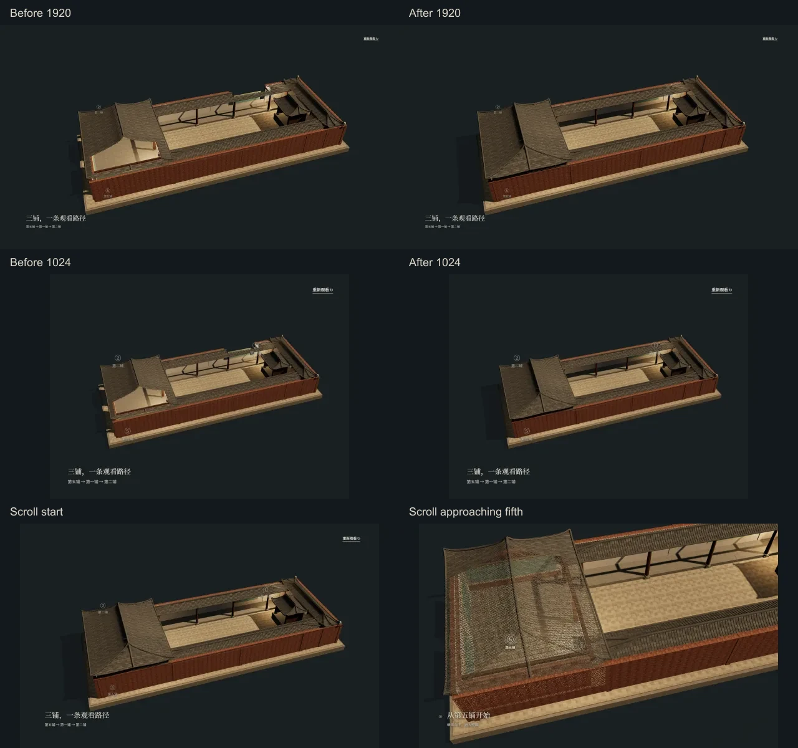

# A04 总结屋顶恢复 · 2026-10-05

基线：`45153bd4777a7da537211f9cc9c407a3ab71da08`。依据用户两处浏览器批注：最后第一铺上方不透空；第五铺上方也不透空，后续下拉靠近第五铺时再打开。范围为Module A A04总结/交接与共享cutaway必要修改，不重制其他章节。

总结不再保留两处固定窗口。共享shader改为局部窗口乘以`1-summary`：36–41秒回撤逐渐关闭，41秒起完整屋顶保持；跳过、重播后完成、刷新、reduced motion的总结均完整。后续16屏起沿既有下拉进度重新打开第五铺局部窗口，第一铺不再打开；反向返回16屏重新关闭。完整屋顶恢复原阴影，局部透空时关闭未剖切的投影阴影，避免阴影残影。自动内部观看的三铺剖切、45秒时长、路线/镜头、四角投影交接、字幕/说明字号颜色与位置均保留。

未改GLB、anchor、原始壁画、Module B、A05–A08内容或低保真归档。无新增geometry/material、资源、Canvas或渲染循环；原有工作区的归档启动器改动和照片删除不纳入本次提交。

100项单元测试通过，新增总结关闭→第五铺渐进打开→反向关闭检查，更新真实Three材质阴影恢复/局部透空测试。原生ES模块/内嵌模块语法检查、受保护资源和固定归档refs检查通过。

Chrome实际运行在1920×1080、1440×900、1366×768、1024×768检查：完整总结、下拉起点/中段/第五铺接近、反向返回、刷新、reduced motion及快速跨章，单canvas且roof opacity=1/depthWrite=true。1440×900另真实等待45秒播放，20秒内部剖切保留、39秒回撤关闭中、41秒及45秒完整。修改前1920/1024截图通过Git原HTML与剖切模块请求拦截载入基线，不把当前状态当修改前。四尺寸A04→A05投影/反向/resize/刷新检查通过；A03既有五尺寸浏览器回归通过。结果见 [results.json](results.json)、[build-results.json](build-results.json)、`logs/`。

复现：localhost运行现有A01 server，使用已有Chrome、Playwright/Sharp执行 `node module-a/a04/roof-summary-check.cjs`；不新增页面依赖或外部服务。对照图为原浏览器截图WebP压缩，未改图。剖切仍为数字展示处理，不表示真实建筑洞口。此轮未重新测量跨设备GPU性能；恢复原阴影可能增加总结状态的shadow绘制，但未增加几何或后处理。

最终提交与本报告同一提交，SHA用 `git log -1 --format=%H -- docs/validation/a04-roof-summary-2026-10-05/README.md` 获取，交付消息给出实际提交与远程核实结果。
