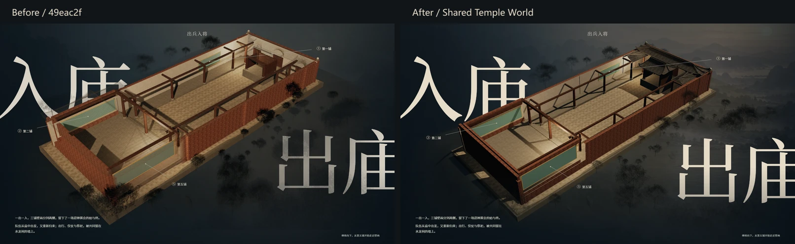
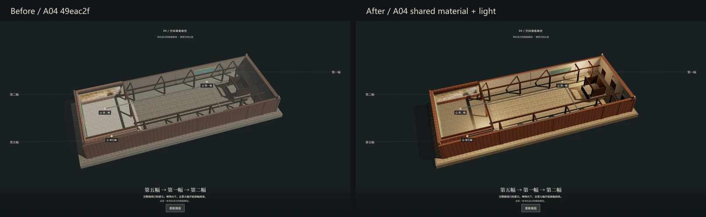
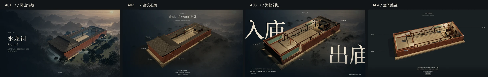
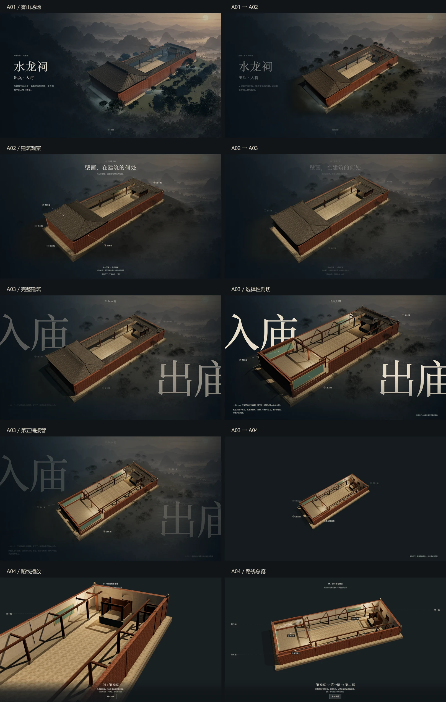
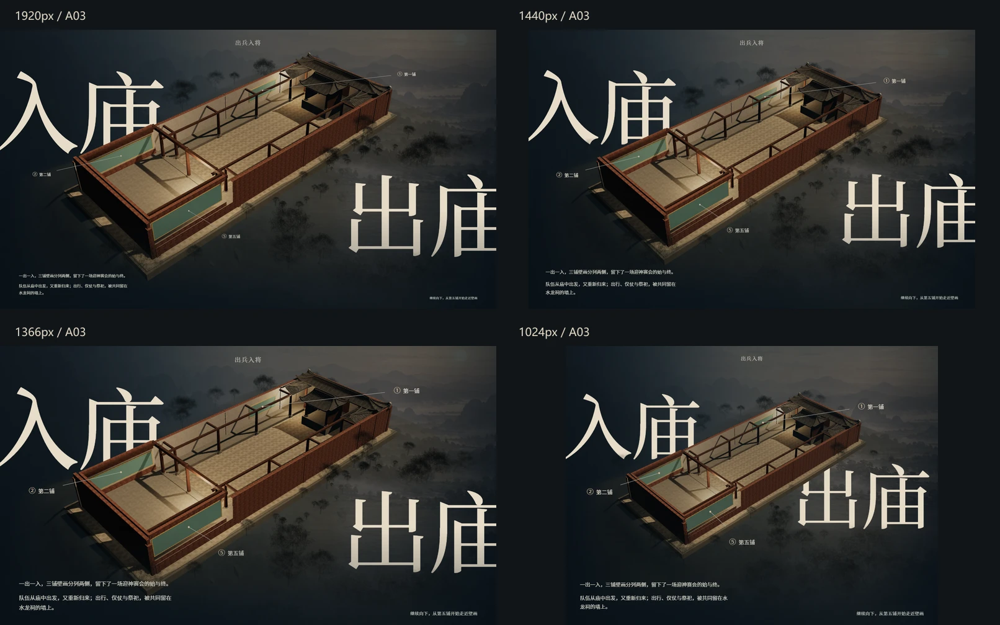

# Shared Temple World + A03 selective cutaway

日期：2026-10-04开始，2026-10-05完成A04材质/光照追改。开始时已 fetch 并核实 HEAD 与远程 master 一致：`49eac2fbc3e31a545e970a723c0db37120692586`。范围为 Module A 的 A01–A03 共享呈现及 A04 入口状态恢复及用户追加的建筑材质/光照统一；不开发新的 A04 路线或 Module B。

## 已确认事实与视觉判断

技术事实通过源码、对象身份、浏览器和资源检查确认；Q1–Q20 中“精致”“海报感”等属于本轮截图审查判断，不代表用户最终视觉冻结。山谷、树和光场属于设计性环境，不是水龙祠实测地形。参考图只用于构图、冷暖和层次分析，建筑结构完全以项目现有模型为准。未调用 ImageGen、未改原始文物图像、未新增文化释读。

参考图的建筑约占横向20%–88%、纵向13%–82%，暖光集中在后方右上屋檐/木构，左侧和前景较暗，巨字由建筑与枝叶穿插。现有模型视角下主殿在左前、入口/戏台在右后，与概念图建筑细节不同；保留该结构和方位，没有镜像或替换建筑。采用同一远山、较安静的树层和选择性剖切来表达相似的展陈关系。

## 一个世界的实现

- `shared-world.mjs` 只管理呈现权重。实际 GLB root、Three scene、renderer、程序场地实例和 DOM 远山图层沿用既有实例；浏览器逐章核实对象引用不变及同一渲染 canvas。
- `ink-scene.mjs` 使用共享远山权重；A02 取消第二份山谷背景，改为半透明暗场承托。旧受控预览里隐藏的 legacy environment 不再实例化，独立模型预览仍保留其原入口。
- 实体近景树和场地给出实际透视，远山图层建立后景。没有新增树、高清背景、HDR、视频、后处理或动态雾。环境的材质透明度、前景覆盖和静态雾量由滚动权重控制。
- A02 暗场稳定合成层，避免先后经过 A03 时浏览器合成路径变化造成背景量化差；A03 倒滚仍使用原像素验收阈值。

稳定态候选权重（实际效果还受场地建立进度和材质明暗控制）：

| 章节 | 场地/植被 | 近景 | 远山 | 静态雾 | 建筑 |
| --- | ---: | ---: | ---: | ---: | ---: |
| A01，5.7屏 | 1 | 1 | 1 | 1 | 1 |
| A02，9.65屏 | .62 | .31 | .58 | .279 | 1 |
| A03，12.15屏 | .44 | .22 | .52 | .198 | 1 |
| A04，13.2屏及后 | 0 | 0 | 0 | 0 | 1 |

权重由纯函数连续导出，没有进入章/离开章后累积改色。反滚和跳章重新计算相同状态；A04 对象不重建，只关闭外围环境。

## A03 排版、植被与光线

左上“入庙”、右下“出庙”，顶部只显示“出兵入将”。两段既有正文逐字保留。沿用本地字体和既有字体子集，无字体/CDN新请求。右下字位在1024px做必要上移/内收，使真实墙体仍能遮字；四尺寸无标签/正文碰撞。

每次 render/resize 从两个 span 的实际 `getBoundingClientRect()` 取得字框，按实际 iframe 的位置和尺寸归一化，传给现有环境 shader；滚动/resize render重新读取字位、字体和实际窗口尺寸，避免用旧硬编码矩形匹配新排版。核心区域降至接近零覆盖，字框边缘以约6%屏幕宽高的软过渡恢复枝梢，外围保留原树林。此处理只作用于植被/地面/静态雾；建筑材质没有标题遮罩。标题 z-index 2、真实 WebGL 建筑3、说明与标签在前；建筑遮字由真正的模型轮廓产生。

A01 维持原电影化光照与后处理；A02 保留既有冷色观察光、院落/廊下局部补光；A03 重用同一太阳光，移到后方右上 `(-8,20,16)`，候选强度4.6、fill .52、exposure 1.10，局部灯仍为已有实例。场地冷暗，暖光主要落在铺地、砖/木构；用户追加要求后，A04继承A02/A03的砖、木、灰面调色和粗糙度，复用同一暖太阳、冷半球光和两个局部灯；exposure 1.10、sun 4.6、fill .52、墨色fog #15222b/density .0045。取消旧灰白雾与非当前建筑整体灰化，12.3–13.05屏连续接入。相机、壁画图像、转场节奏不变，仍无外围山林。真实壁画展示材质原已设置 toneMapped:false、fog:false，排除本次曝光与雾色变化；本轮不改该材质。

## 选择性剖切与交接

没有新增建筑 mesh、材质皮、拼贴或模型几何。`cutaway.mjs` 对既有 roof/wall 材质片元作局部裁切：

- A03 初段保留完整建筑；10.75–11.30屏移除主殿3个屋面 mesh，稳定态 `visible=false`，停止其屋面绘制和阴影。
- 11.30–11.75屏打开廊屋面 `z<7.1` 区域，保留靠入口一端的屋面及现有梁柱，不把全部廊屋面整体透明。
- 近侧墙皮只打开 `x<-4.2、z=-15.15…-8.1、y=.86…2.95` 的遮挡窗口；墙脚、上缘、端头、木构和原模型墙面仍在。稳定片元裁切保持其余砖/灰墙不透明，消除整体透明墙的幽灵重叠。
- 入口 `07_Entrance` 与戏台 `06_Stage` 屋顶在海报稳定态始终 opacity 1，保留建筑识别；12.85–13.20屏才接到原A04的 .08 屋面入口态。
- 保留A03三屏、稳定阅读区、①②⑤原墙面anchor、第五铺接管及13.202屏A04实际入口。边界13.195–13.25屏检查相机、第五铺投影及屋面透明度，修复13.201屏屋顶闪回；快速跳A04时恢复屋顶无阴影状态，反滚到A01/A02恢复原屋面。
- 减少动态偏好在阅读区直接给出稳定剖切，无自动飘雾或树摆。A04原⑤→①→②路线、58秒时钟、回撤/总结和A04→A05交接保持。

## 性能

GPU：NVIDIA GTX 1660 Ti / ANGLE D3D11。几何/纹理统计及下表draw calls在1920和1440两尺寸一致，均实测而非推算。

| 状态 | Calls Before→After | 提交三角形 Before→After | Geometries Before→After | Textures Before→After |
| --- | ---: | ---: | ---: | ---: |
| A01 | 47→47 | 170210→170210 | 53→53 | 22→22 |
| A02 | 57→57 | 170510→199452 | 64→63 | 20→20 |
| A03-complete | 63→57 | 206654→199452 | 64→63 | 20→20 |
| A03-transition | 63→58 | 206654→200892 | 64→63 | 20→20 |
| A03-stable | 63→54 | 206654→186108 | 64→63 | 20→20 |
| A03-fifth | 63→54 | 206654→186108 | 64→63 | 20→20 |
| A04-entry | 52→52 | 90506→90506 | 65→65 | 22→22 |
| A04-playing | 44→24 | 90322→5202 | 65→65 | 22→22 |
| A04-overview | 73→53 | 91586→6466 | 78→78 | 23→23 |

A03稳定态calls减少14.3%，提交三角形减少9.9%；A04播放态calls减少45.5%。A02因平滑透明双面植被多一次面提交，三角形170510→199452（+17.0%），并未新增几何或树；不把这部分报告为性能下降已消除。

| 窗口 / 状态 | 平均帧间隔ms Before→After | P95 ms Before→After |
| --- | ---: | ---: |
| 1920 / A01 | 4.17→4.21 | 4.50→4.80 |
| 1920 / A02 | 4.19→4.18 | 4.70→4.50 |
| 1920 / A03-complete | 4.16→4.17 | 4.80→4.60 |
| 1920 / A03-transition | 4.17→4.18 | 4.70→5.00 |
| 1920 / A03-stable | 4.16→4.18 | 4.80→4.70 |
| 1920 / A03-fifth | 4.17→4.17 | 4.70→4.80 |
| 1920 / A04-entry | 4.17→4.17 | 5.50→6.50 |
| 1920 / A04-playing | 4.17→4.17 | 5.90→6.10 |
| 1920 / A04-overview | 4.17→4.17 | 4.60→4.40 |
| 1920 / A03-scroll | 8.64→8.72 | 14.20→14.10 |
| 1440 / A01 | 4.17→4.15 | 4.60→4.70 |
| 1440 / A02 | 4.13→4.21 | 4.70→4.50 |
| 1440 / A03-complete | 4.17→4.17 | 4.30→4.40 |
| 1440 / A03-transition | 4.17→4.17 | 4.80→4.70 |
| 1440 / A03-stable | 4.25→4.17 | 5.20→4.30 |
| 1440 / A03-fifth | 4.17→4.17 | 4.40→4.90 |
| 1440 / A04-entry | 4.16→4.16 | 5.50→6.00 |
| 1440 / A04-playing | 4.21→4.16 | 5.50→6.10 |
| 1440 / A04-overview | 4.17→4.17 | 4.70→4.40 |
| 1440 / A03-scroll | 8.26→8.44 | 12.80→13.80 |

| 窗口 | HTTP资源 MiB Before→After | 响应数 / GLB读取次数 | 就绪耗时ms Before→After（单次） | A03稳定JS heap MiB Before→After |
| --- | ---: | --- | ---: | ---: |
| 1920 | 17.62→17.09 | 66→66 / 1→1 | 2625→3655 | 40.15→32.13 |
| 1440 | 17.62→17.09 | 66→66 / 1→1 | 1858→2255 | 51.82→40.69 |

HTTP资源减少553612字节（约0.53MiB）；浏览器统计中纹理数量不增加。帧间隔多数接近，1440滚动P95为12.80→13.80ms、A04播放P95也有轻微增加，不宣称所有状态提速。单次就绪耗时比Before长，受缓存/编译/浏览器调度影响且不是重复统计，不能据此宣称首屏改善；JS heap随GC变化也不是显存指标。


完整样本见 `performance.json`。同机 headless Chrome，每个稳定态10帧预热、90帧取样，单独取100帧A03滚动窗口中的90帧。帧间隔包含浏览器/GPU调度，不等于GPU耗时，也不保证其他设备达到同样帧率。资源字节按浏览器实际HTTP响应计数，不把离线Blob副本再次计入网络；localhost模式实际读取1次既有GLB。Heap 是 Chrome 的 JS heap 估算，不是显存或系统总内存。

主殿屋面停止绘制、A02/A03外围植被不投影、跳过受控模式旧环境实例，缓存灯光 Color/Vector 临时量，并在剖切权重为0时跳过片元噪声计算。不增加模型、树数量、纹理、render target；A01原后处理保持，A02–A04后处理关闭。局部廊屋面/墙皮的片元裁切仍提交原几何，不能把它们计作几何已删除。

## 自动检查及人工截图审查

- Node相关测试94/94通过；源码语法、离线inline module解析、保护文件对照和固定归档引用检查通过。项目没有额外打包步骤，本地入口实际运行通过。
- A01四尺寸72帧、刷新/倒滚/resize/跳章和6种fallback通过；A02五尺寸、状态与倒滚通过。
- A03五尺寸浏览器检查及四尺寸精修检查通过：文案、字体层级、真实anchor投影、稳定阅读、滚轮、刷新、反滚像素、减少动态偏好、resize、边界交接。
- 共享世界四尺寸44个指定状态截图及4张A04播放补充截图完成；逐章对象身份不变、单canvas、环境退出/恢复、屋面回退通过。四尺寸移动实际DOM标题字位后，shader安全区同步更新。
- “出庙”环境清理专项通过：四尺寸实际渲染中，启用/关闭标题避让的对照确认主体笔画污染明显降低；真实建筑遮字专项1920/1024通过，没有用CSS假建筑遮罩。
- A04完整58秒⑤→①→②、回撤、路线总结、skip/replay、键盘、页面可见性模拟、减少动态偏好通过；四尺寸A03→A04→A05、延迟/失败加载、resize和导读交接通过。新旧A04总览相机与路线growth数值完全一致；最新材质/光照状态正确且外围环境关闭。
- 人工逐图核对A01–A04连续场景、四尺寸A03海报、A04总览及近景停靠。最终压缩证据与原始PNG对应。

保护检查以基线直接 `git show` 对照实际旧源，通过浏览器请求拦截读取旧版本，避免把After误当Before。GLB、model-source、model-info、mural-locations、A04–A08、Module B和原壁画资源的 Git diff 均为空。固定归档 tag/branch 仍为 `48f272497e86e4549c5bcd0dee275ff347171a3f`。本地原已有归档脚本/文档改动和两张照片删除未纳入本次提交。

浏览器没有页面错误或非预期失败请求。A03像素回退使用原max≤2/255量化或max≤16且变化面积<.5%阈值；A02检查采用同一2/255合成量化规则，不容忍大面积更高差异。A01基线保护与动画回退同时检查；A04按最新用户要求有意改变材质/光影，改为核对相机/路径/资源一致而非要求旧灰色画面像素相等；state数值和对象身份保持精确相等。

## 视觉证据

要求的11张1920×1080 WebP位于本目录：`01-a01-stable.webp`、`02-a01-a02-transition.webp`、`03-a02-stable.webp`、`04-a02-a03-transition.webp`、`05-a03-entry.webp`、`06-a03-poster.webp`、`07-a03-cutaway.webp`、`08-a03-three-murals.webp`、`09-a03-fifth-focus.webp`、`10-a03-a04-transition.webp`、`11-a04-route.webp`。补充 `12-a04-playing.webp`。同样四尺寸在 `viewports/1920、1440、1366、1024/`。











## Q1–Q20 人工审图

| 项 | 本轮人工审查结论与依据 |
| --- | --- |
| Q1 A01→A02是否同一世界 | 是。相同山谷、斜坡、树层和建筑渐次降权/回中；两帧之间未换模型。见sequence-detail-board前3格及横向sequence-board。 |
| Q2 A02是否有弱山谷纵深 | 是。山层与灰暗树群可辨，低于暖建筑和标题的对比；没有纯黑断场，也没有恢复A01的景观高潮。 |
| Q3 A03是否更精致 | 本轮判断有明确改善：巨字更干净、屋面/墙体不再全透明、入口屋顶实心、三铺关系更直接。建筑仍为现有简化材质，摄影质感未达到概念图。 |
| Q4 左上是否入庙 | 是，四尺寸逐图核对。 |
| Q5 右下是否出庙 | 是，1024窗口略上移/内收，仍在入庙的右下。 |
| Q6 出庙是否不再被大片树林覆盖 | 是。1920/1440/1366和1024主要笔画清楚，无连续树冠纹理铺满字形。 |
| Q7 是否有少量枝梢且非硬裁 | 羽化边缘仍有低权重枝梢，字心清理；小屏自然穿插很克制。字框避让为连续软边，没有硬矩形切口。 |
| Q8 巨字是否被真实建筑遮挡 | 是。墙沿遮入庙下部，小屏墙体同时遮出庙上缘。专项像素分离检查：1920遮字7075像素/6.88%，1024为1808像素/4.59%。 |
| Q9 是否有假mask代替建筑 | 没有。DOM字框只清理环境，建筑用真实WebGL模型绘制；未添加伪建筑轮廓、CSS字形剪贴或2D建筑蒙版。 |
| Q10 是否像海报 | 本轮判断是：斜向建筑居中、左右巨字裁切、顶部单主题、左下小正文构成主视觉；不是新增自由旋转模型界面。仍保留项目模型的简化表现。 |
| Q11 是否有前/中/远景 | 有。近侧暗植被/坡地、建筑与壁画所在墙面、灰树群/远山分别承担层次；使用原场地对象，未加背景资源。 |
| Q12 暖光是否强化建筑 | 是。暖光主要落在院落铺地和后方木构/砖墙，背景仍为冷墨灰；近侧暗部仍区分砖、木、灰泥和石台。 |
| Q13 主殿是否更像剖切 | 是。主殿屋面不再绘制，梁柱和墙脚保持；近侧墙皮窗口切除，避免全墙半透明互相叠影。 |
| Q14 入口屋顶是否完整 | 是。海报稳定帧07_Entrance与06_Stage均保持不透明完整屋顶。仅末端过渡接回原A04透明入口。 |
| Q15 三铺是否能读作内墙位置 | 是。绿色原模型壁面位于原建筑墙体，①②⑤引线落在这些墙面上，不是漂浮的外置图片卡。实际壁画内容仍属后续导读/探索。 |
| Q16 anchor是否来自真实模型 | 是。复用原GLB墙面节点投影；mural-locations、geometry和anchor来源未改，线端与实际投影逐项比较通过。 |
| Q17 第五铺是否接管 | 是。①②按原时序降权，⑤保持，提示跟随⑤投影；没有提前播放路线。见09与10。 |
| Q18 A03→A04是否连续 | 是。边界相机、画布、⑤投影和屋面opacity连续；13.201闪回与快速跳章残留阴影已修复。 |
| Q19 A04是否退出外围山林 | 是。远山DOM隐藏，场地group.visible=false，环境/雾/植被权重0；模型与环境实例均保留供反滚恢复。总览截图无外围山林。 |
| Q20 ⑤→①→②是否未修改 | 是。A04源码、路径几何、时钟与58秒逻辑的基线Git diff为空；原路线播放/回撤/总结、刷新、反滚和A04→A05检查通过；共享光照属于用户追加的呈现改动。 |

## 重现

先运行现有 `node module-a/a01/server.mjs`（或复用4173端口），NODE_PATH指向已安装的 Playwright/Sharp。依次运行：

```text
node shuilong-temple/shared-world-sync.mjs
node --test module-a/*/*.test.mjs module-a/*.test.mjs shuilong-temple/*.test.mjs
node module-a/a03/build-check.cjs
node shuilong-temple/shared-world-regression.cjs a01
node shuilong-temple/shared-world-regression.cjs a02
node module-a/a03/browser-check.cjs
node module-a/a03/remaster-check.cjs
node shuilong-temple/shared-world-a04-look-check.cjs
node shuilong-temple/shared-world-title-check.cjs
node shuilong-temple/shared-world-regression.cjs occlusion
node shuilong-temple/shared-world-regression.cjs a04
node shuilong-temple/shared-world-regression.cjs transition
node shuilong-temple/shared-world-regression.cjs resilience
node shuilong-temple/shared-world-check.cjs
node module-a/a03/performance-check.cjs
node shuilong-temple/shared-world-boards.cjs
```

`A03_VALIDATION_DIR` 可指定本轮 `browser/`。A04检查仅由wrapper改端口/结果输出，不改原检查或路线源码。压缩WebP作为交付；原始PNG保留本地用于像素验收。

## 限制

本轮以1920×1080、1440×900、1366×768、1024×768 PC窗口验收，未声称完整移动端适配或用户最终审图冻结。模型材质与几何仍是项目现有简化建筑，无法在不替换/重塑文物模型的前提下逐像素复制概念图的摄影质感。近侧墙窗口的坐标是针对现有模型的展示设计值，后续若模型换版应重新核对，而不是推断真实建筑剖切范围。
